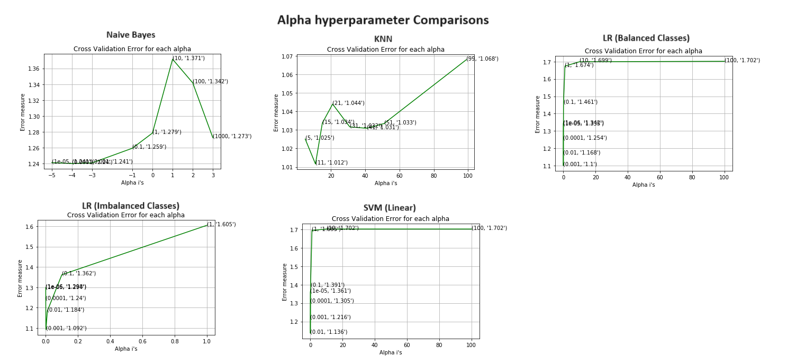

# ML_Exercise_Cancer_Medical_Treatment
A repository that contains practice code for ML algorithms implementation on a cancer treatment medical dataset from Kaggle (Text Processing, Response Encoding, Feature Engineering, Classification).

Used packages:

| Seaborn | Matoplotlib | Pandas | Math    |
|---------|-------------|--------|---------|
| Numpy   | Sklearn     | re     | mlxtend |
| nltk    | Collections | Scipy  |         |

Built Classifiers:
* Naive Bayes (NB)
* Stochastic Gradient Descent Classifier (SGD)
* Logistic Regression (LR)
* K-Nearest Neighbor (KNN)
* Random Forest (RF)
* Support Vector Machine (SVM)
* Calibrated Classifier
* Stacking Approach (Multiple Models Together -LR, SVM, NB-)
* Maximum Voting Classifier (MVC) Approach (3 models and chooses the one with the lowest error measure)

Files:

| File Name       | Description                                                                                                                                                                                                       |
|-----------------|-------------------------------------------------------------------------------------------------------------------------------------------------------------------------------------------------------------------|
| explore_data.py | Explore the downloaded files and perform initial preprocessing such as cleaning, preprocessing text, and merging files.                                                                                                |
| prepare_data.py | Work with the merged dataset to perform advanced preprocessing such as encoding variables and split them into train, test, and validation sets for model training.                                                        |
| train_model.py  | Take the 3 sets of data to train various classifiers and the focus is on trying multiple approaches (One-Hot Encoding and Response Encoding) and model interpretability such as word occurrence and feature importance. |
| functions_.py   | A file that acts as a central file for main functions used during multiple stages such as preprocessing and data handling across multiple files.                                                                  |

---

Dataset link on Kaggle: [Memorial Sloan Kettering Cancer Center (MSKCC) Personalized Medicine: Redefining Cancer Treatment](https://www.kaggle.com/competitions/msk-redefining-cancer-treatment)

The data that was preprocessed and trained in the exercise belongs to the following files:
* training_variants.zip (ID, Gene, Variations, Class)

Contains the information about the genetic mutations.

| Field Name | Description                                                              |
|------------|--------------------------------------------------------------------------|
| ID         | The ID of the row is used to link the mutation to the clinical evidence. |
| Gene       | The gene where this genetic mutation is located.                         |
| Variation  | The amino-acid change for this mutation.                                |
| Class      | 1-9 categories of genetic mutation.                                      |

  
* training_text.zip (ID, Text)

Contains the clinical evidence (text) that human experts/pathologists use to classify the genetic mutations.

| Field Name | Description                                                              |
|------------|--------------------------------------------------------------------------|
| ID         | The ID of the row is used to link the mutation to the clinical evidence. |
| Text       | Clinical evidence used by the experts/pathologists.                      |

---

While processing the data and training the model an approach was followed comparing the model's performance using multiple alpha's to help determine the best alpha (learning rate) to train the classifier on.

To choose the best alpha hyperparameter for the model's training, various alphas were tested on the model, and the one that presented the lowest error measure (log loss) was selected. The above graph plots the error measure log loss for each of the tested alphas, below is the best alpha used for each of the models.

| Model                                             | Best Alpha |
|---------------------------------------------------|------------|
| Naive Bayes (One Hot Encoding)                    | 0.0001     |
| KNN (Response Encoding)                           | 11         |
| LR (Without Balancing Classes) (One Hot Encoding) | 0.001      |
| LR (With Balancing Classes) (One Hot Encoding)    | 0.001      |
| SVM (Linear) (One Hot Encoding)                   | 0.01       |
| RF (One Hot Encoding)                             | 200        |
| RF (Response Encoding)                            | 100        |
| Stacking Models (One Hot Encoding)                | 0.100000   |

Log Loss comparison across train, cross-validation, and test sets.

| Model                                             | Train Set Loss | Cross-Validation Set Loss | Test Set Loss | Classification Error |
|---------------------------------------------------|----------------|---------------------------|---------------|----------------------|
| Naive Bayes (One Hot Encoding)                    | 0.84           | 1.24                      | 1.25          | 37.70                |
| KNN (Response Encoding)                           | 0.65           | 1.01                      | 1.07          | 33.83                |
| LR (Without Balancing Classes) (One Hot Encoding) | 0.61           | 1.09                      | 1.07          | 34.77                |
| LR (With Balancing Classes) (One Hot Encoding)    | 0.61           | 1.10                      | 1.06          | 35.33                |
| SVM (Linear) (One Hot Encoding)                   | 0.74           | 1.13                      | 1.14          | 34.21                |
| RF (One Hot Encoding)                             | 0.71           | 1.14                      | 1.12          | 38.34                |
| RF (Response Encoding)                            | 0.05           | 1.28                      | 1.30          | 48.68                |
| Stacking Models (One Hot Encoding)                | 0.66           | 1.11                      | 1.11          | 35.78                |
| Maximum Voting Classifier (One Hot Encoding)                | 0.91           | 1.18                      | 1.20          | 35.63                |

An obvious overfitting can be noted on the Rd model using the response encoded data based on the huge gap in the log loss between the training set (very low) and the other sets (cross-validation and test), also it has the highest number of misclassified points 48.68 (0.4868 x 100).

Various metrics can have different meanings and the decision on which model to choose depends on our objective, if the objective is to choose a model that has the highest accuracy then we would choose the model that has the lowest classification error which is KNN with the lowest number of misclassified points. If the objective is to choose the model that has learned well and can distinguish in terms of likelihood and predict better in correspondence to the actual value we would choose LR with balanced classes as it has the lowest test set loss with a relatively low number of misclassified data points of 35.33 (0.3533 x 100) and low training set log loss of 0.61.

